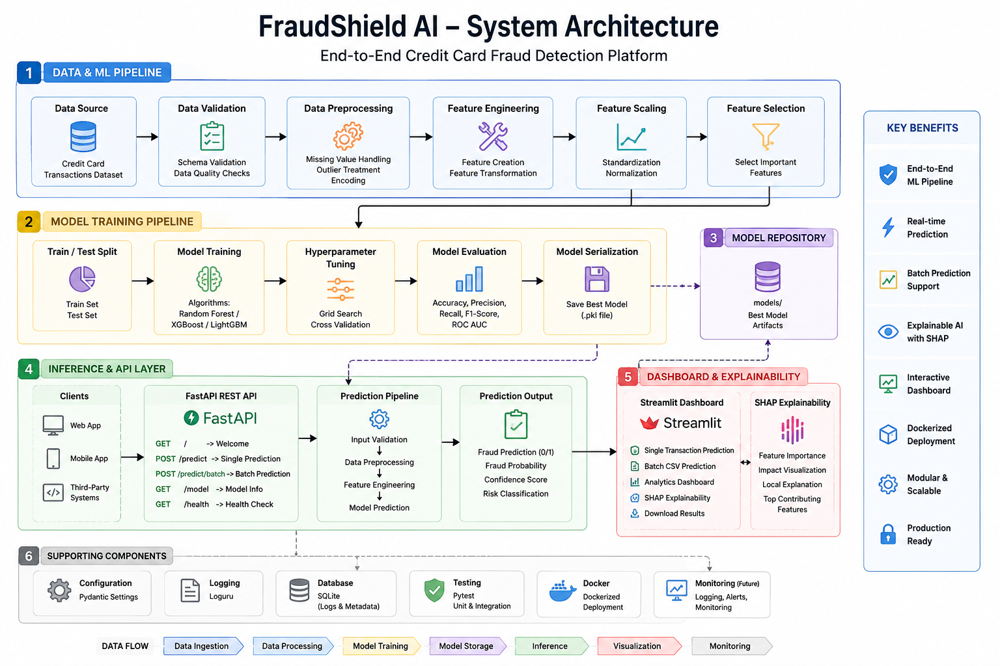
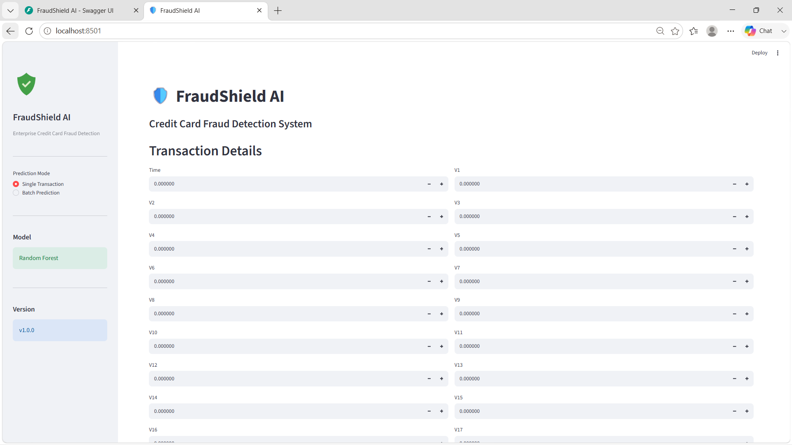
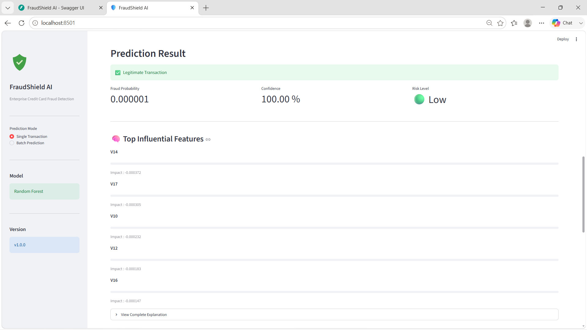
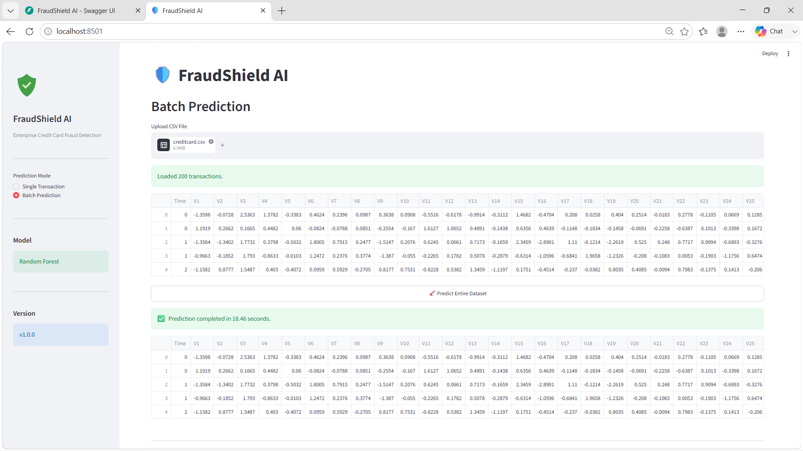
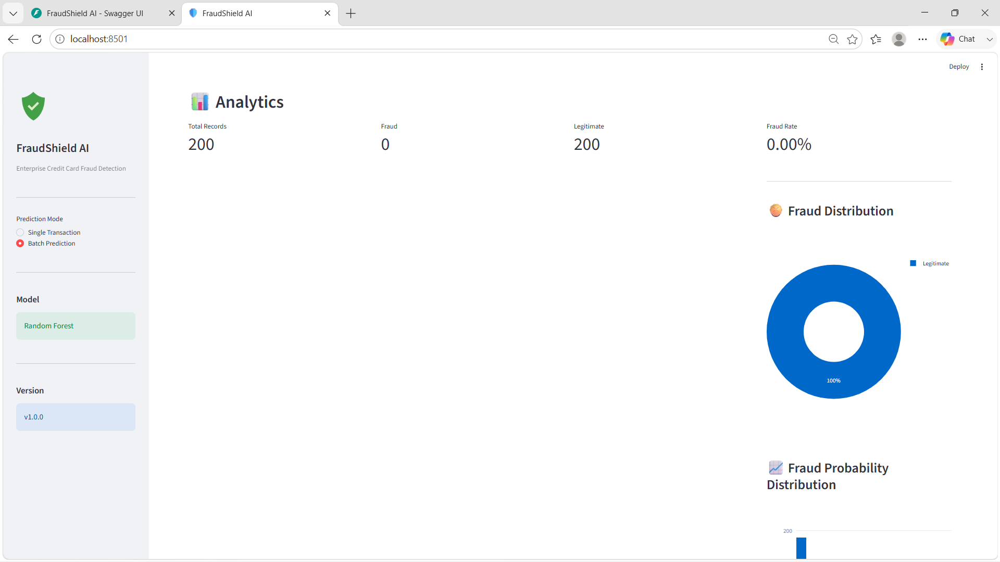
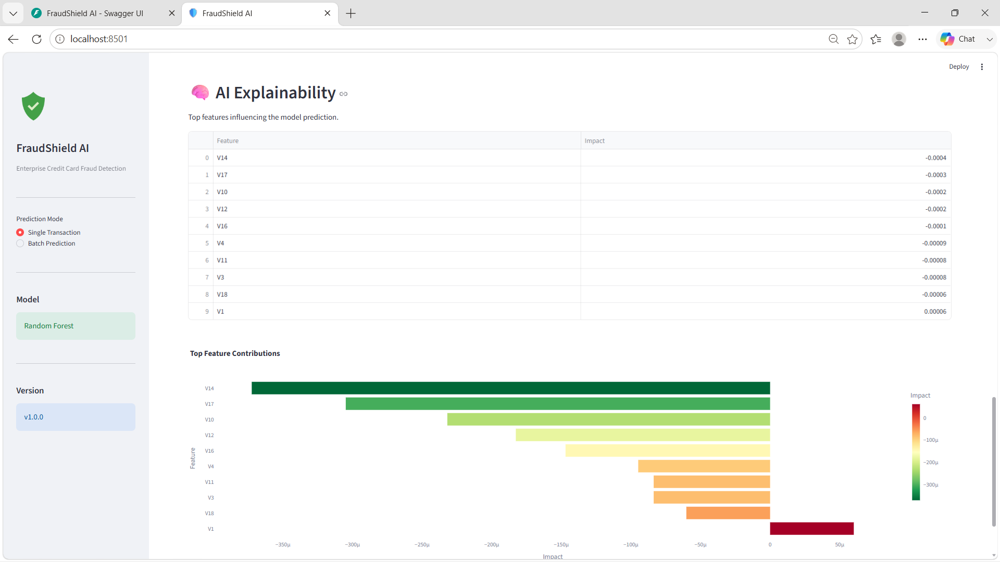
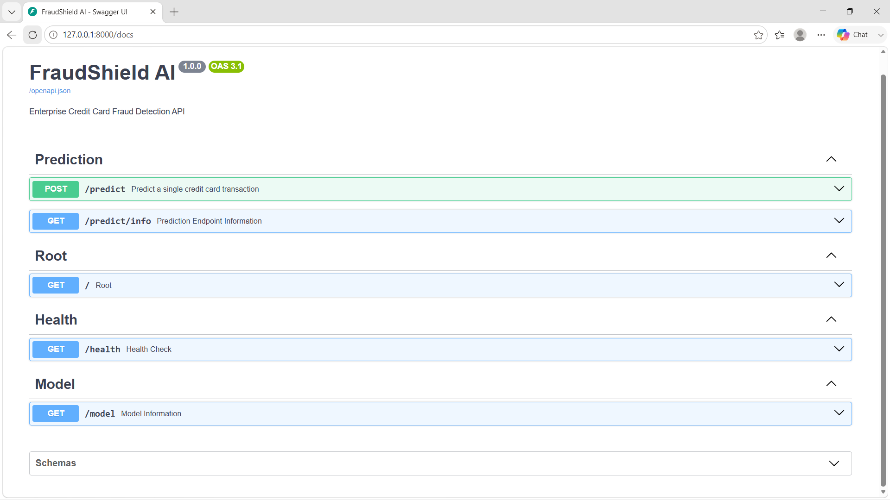
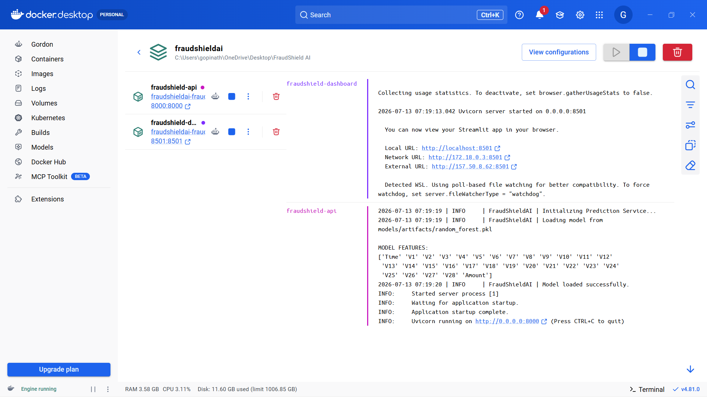
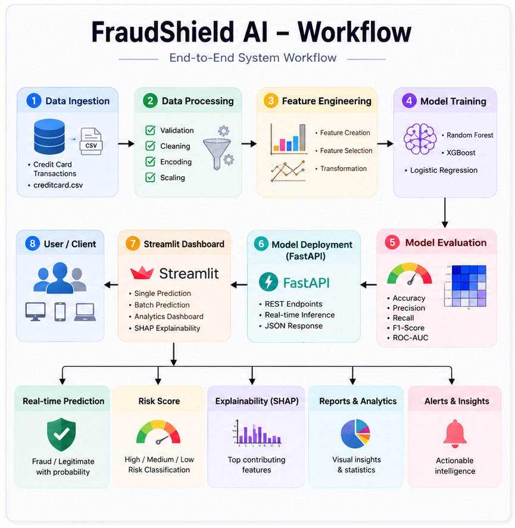

# 🛡️ FraudShield AI

> **An Enterprise-Grade Credit Card Fraud Detection Platform powered by Machine Learning, FastAPI, Streamlit, and Explainable AI.**


---

# 📖 Overview

FraudShield AI is an end-to-end machine learning application for detecting fraudulent credit card transactions in real time. The project combines data preprocessing, feature engineering, model training, explainable AI, REST API development, and an interactive dashboard into a production-style architecture.

Unlike traditional machine learning projects that stop after training a model, FraudShield AI provides a complete workflow from data ingestion to prediction, visualization, explainability, and deployment.

---

# ✨ Features

- Credit Card Fraud Detection
- End-to-End Machine Learning Pipeline
- Automated Data Validation
- Feature Engineering Pipeline
- Missing Value Handling
- Feature Scaling
- Feature Selection
- Model Training & Evaluation
- Explainable AI using SHAP
- Single Transaction Prediction
- Batch CSV Prediction
- Analytics Dashboard
- FastAPI REST API
- Interactive Streamlit Dashboard
- Docker Support
- Logging & Configuration Management
- Modular Project Architecture

---

# 🌟 Project Highlights

- Enterprise-grade project architecture
- Production-ready FastAPI backend
- Interactive Streamlit dashboard
- Explainable AI using SHAP
- Dockerized deployment
- Modular and scalable codebase
- REST API for real-time inference
- Batch prediction support
- Analytics dashboard
- Unit testing support
  
---

# 🏗️ System Architecture

<p align="center">

</p>

```text
                 Credit Card Dataset
                         │
                         ▼
                 Data Validation
                         │
                         ▼
                Data Preprocessing
                         │
                         ▼
              Feature Engineering
                         │
                         ▼
             Machine Learning Model
                         │
            ┌────────────┴────────────┐
            ▼                         ▼
      FastAPI REST API        Streamlit Dashboard
            │                         │
            └────────────┬────────────┘
                         ▼
                 Fraud Prediction
                         │
                         ▼
               SHAP Explainability
```

---
# 📂 Project Structure

```text
FraudShield-AI/

├── app/
│   ├── api/
│   ├── config/
│   ├── core/
│   ├── routers/
│   ├── schemas/
│   └── services/
│
├── dashboard/
│   ├── components/
│   └── main.py
│
├── src/
│   ├── data/
│   ├── feature_engineering/
│   ├── training/
│   ├── evaluation/
│   ├── inference/
│   ├── explainability/
│   └── visualization/
│
├── models/
├── data/
├── tests/
├── docs/
├── Dockerfile
├── docker-compose.yml
├── requirements.txt
├── setup.py
└── README.md
```
---

# 📚 Documentation

Detailed documentation is available in the **docs/** directory.

| Documentation | Description |
|--------------|-------------|
| docs/api | API Documentation |
| docs/architecture | System Architecture |
| docs/diagrams | Architecture & Workflow Diagrams |
| docs/images | Dashboard Screenshots |
| docs/reports | Project Reports |

---

# ⚙️ Technology Stack

| Category | Technologies |
|-----------|--------------|
| Programming | Python 3.12 |
| Machine Learning | Scikit-Learn, XGBoost, LightGBM |
| Data Processing | Pandas, NumPy |
| Explainability | SHAP |
| API | FastAPI |
| Dashboard | Streamlit |
| Visualization | Plotly, Matplotlib |
| Database | SQLite |
| Deployment | Docker |
| Testing | Pytest |
| Configuration | Pydantic Settings |

---

# 📸 Dashboard Preview

## 🏠 Home Dashboard

<p align="center">

</p>

---

## 🔍 Single Prediction

<p align="center">

</p>

---

## 📂 Batch Prediction

<p align="center">

</p>

---

## 📊 Analytics Dashboard

<p align="center">

</p>

---

## 🧠 Explainability

<p align="center">

</p>

---

## 🌐 FastAPI Swagger

<p align="center">

</p>
---

# 🚀 Installation

Clone the repository:

```bash
git clone https://github.com//FraudShield-AI.git

cd FraudShield-AI
```

Create a virtual environment:

```bash
python -m venv .venv
```

Activate the environment:

### Windows

```bash
.venv\Scripts\activate
```

### Linux / macOS

```bash
source .venv/bin/activate
```

Install dependencies:

```bash
pip install -r requirements.txt
```

---

# ▶️ Run the Application

## Start FastAPI

```bash
uvicorn app.main:app --reload
```

API Documentation:

```
http://localhost:8000/docs
```

---

## Start Streamlit

```bash
streamlit run dashboard/main.py
```

Dashboard:

```
http://localhost:8501
```

---

## Run with Docker

<p align="center">

</p>

```bash
docker compose build

docker compose up
```
---

# 🐳 Docker Deployment

FraudShield AI is fully containerized using Docker Compose.

<p align="center">

</p>

The application launches two containers:

| Container | Description |
|-----------|-------------|
| fraudshield-api | FastAPI REST API |
| fraudshield-dashboard | Streamlit Dashboard |

---

# 📊 Dashboard Modules

The Streamlit dashboard includes:

- Single Transaction Prediction
- Batch CSV Prediction
- Fraud Probability
- Confidence Score
- Risk Classification
- Analytics Dashboard
- SHAP Explainability
- Download Prediction Results

---

# 🌐 API Endpoints

| Method | Endpoint | Description |
|----------|----------|-------------|
| GET | / | Welcome endpoint |
| GET | /docs | Swagger UI |
| POST | /predict | Fraud prediction |
| GET | /health | Health check |
| GET | /model | Model information |

---

# 🤖 Machine Learning Pipeline

<p align="center">

</p>

The complete ML workflow includes:

1. Data Validation
2. Missing Value Handling
3. Feature Scaling
4. Feature Selection
5. Dataset Splitting
6. Model Training
7. Hyperparameter Tuning
8. Model Evaluation
9. Model Serialization
10. Prediction Pipeline

---

# 🧠 Explainable AI

FraudShield AI integrates SHAP to explain model predictions.

Features include:

- Feature Importance
- Transaction-Level Explanation
- Top Contributing Features
- Impact Visualization

---

# 🧪 Testing

Run all tests:

```bash
pytest
```

Run with coverage:

```bash
pytest --cov
```

---

# 📅 Project Status

- ✅ Project Structure
- ✅ Data Pipeline
- ✅ Feature Engineering
- ✅ Model Training
- ✅ Model Evaluation
- ✅ Prediction Pipeline
- ✅ FastAPI API
- ✅ Streamlit Dashboard
- ✅ Batch Prediction
- ✅ Analytics Dashboard
- ✅ Explainable AI
- ✅ Docker Support
- ✅ Logging
- ✅ Configuration Management
- ✅ Unit Testing
- ⏳ Cloud Deployment
- ⏳ CI/CD

---

# 🚀 Future Improvements

- JWT Authentication
- User Management
- PostgreSQL Integration
- Model Monitoring
- Drift Detection
- Automatic Retraining
- Kafka Streaming
- Kubernetes Deployment
- CI/CD Pipeline
- Cloud Deployment (AWS / Azure / GCP)
- Monitoring with Prometheus & Grafana

---

# 📄 License

This project is licensed under the MIT License.

---

# 📈 Repository Information

| Property | Value |
|----------|-------|
| Language | Python |
| Architecture | Modular |
| API | FastAPI |
| Dashboard | Streamlit |
| Explainability | SHAP |
| Deployment | Docker |
| License | MIT |

---

# 👨‍💻 Author

**Gopinath A**

AI & Machine Learning Engineer

GitHub: https://github.com/Gopiarumugam67

LinkedIn: https://www.linkedin.com/in/gopinatha5617/

---

⭐ If you found this project useful, consider giving it a star.